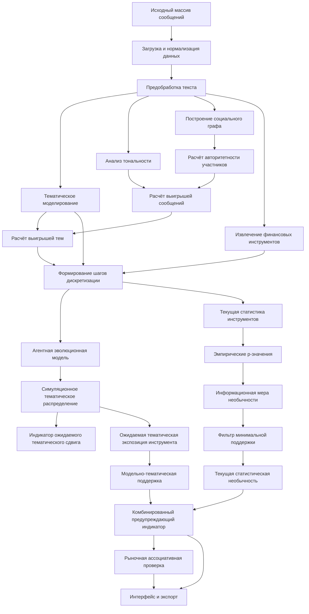

# Программный комплекс анализа дискуссионных событий

## 1. Назначение проекта

Программный комплекс предназначен для исследовательского анализа дискуссий социальных сетей, в которых пользователи обсуждают компании, финансовые инструменты и связанные с ними рыночные события. Система обрабатывает массив пользовательских сообщений, выделяет тематическую структуру дискуссии, моделирует ожидаемую динамику тем, рассчитывает дискуссионные индикаторы по финансовым инструментам и выполняет ассоциативную проверку выявленных событий на рыночных данных.

Проект реализован как исследовательская инструментальная среда для выпускной квалификационной работы на тему:

> «Методы анализа влияния мнений пользователей социальных сетей на ценообразование финансовых инструментов компаний».

Под анализом влияния в проекте понимается не доказательство причинно-следственной зависимости между сообщениями пользователей и ценой финансового инструмента, а исследование статистической, временной и ассоциативной связи между характеристиками дискуссионной среды и последующей рыночной динамикой.

Система не является торговым роботом, инвестиционной рекомендацией или промышленной системой реального времени. Итоговые показатели являются дискуссионными индикаторами, а не вероятностями роста или падения цены.

## 2. Статус программной реализации

Программный комплекс является исследовательским прототипом. Он предназначен для:

- воспроизводимого ретроспективного анализа исторических дискуссий;
- моделирования ожидаемой тематической динамики на основе текущего шага дискретизации и исторического контекста;
- расчёта текущей статистической необычности обсуждения финансового инструмента;
- расчёта модельно-тематической поддержки финансового инструмента;
- построения комбинированного предупреждающего дискуссионного индикатора;
- сопоставления дискуссионных событий с последующей динамикой цены, объёма торгов и волатильности;
- подготовки таблиц, графиков и материалов для экспериментальной части исследования.

## 3. Методическая основа

Программная реализация основана на следующих методических компонентах:

1. тематическое моделирование сообщений социальных сетей;
2. оценка тональности сообщений;
3. расчёт авторитетности участников по социальному графу и активности;
4. извлечение биржевых тикеров и названий компаний из текстов;
5. наследование финансовых инструментов по ветвям обсуждения;
6. агентная эволюционная модель динамики тематического распределения;
7. эмпирическая оценка статистической необычности признаков;
8. нормировка через информационную меру `-ln(p)`;
9. поправка на множественные проверки;
10. рыночная ассоциативная проверка.

Агентная модель не моделирует пользователей. Агент является синтетической единицей тематической массы дискуссии, близкой по смыслу к публикации как к сущности. Начальное распределение агентов задаётся по распределению сообщений между темами в выбранном временном шаге дискретизации. Пользователи используются для расчёта авторитетности, сообщения - для расчёта тем и тональности, а агенты - для моделирования ожидаемого перераспределения тематического внимания.

## 4. Основные термины

| Термин | Значение в проекте |
|---|---|
| Сообщение | Наблюдаемая публикация или комментарий пользователя в социальной сети |
| Шаг дискретизации | Интервал времени, в котором агрегируются сообщения и рассчитываются признаки |
| Тема | Латентная семантическая группа сообщений, выделенная тематической моделью |
| Финансовый инструмент | Биржевая акция или иной инструмент, связанный с компанией |
| Биржевой идентификатор (Тикер) | Краткое публичное обозначение финансового инструмента на рынке |
| Текущая статистическая необычность | Нормированный показатель того, насколько атипично инструмент обсуждается в текущем шаге дискретизации относительно истории |
| Ожидаемый тематический сдвиг | Показатель того, насколько сильное изменение структуры дискуссии ожидает агентная модель |
| Модельно-тематическая поддержка | Показатель связи инструмента с темами, которые модель ожидает усилить |
| Комбинированный предупреждающий индикатор | Итоговый показатель, объединяющий текущую необычность и модельно-тематическую поддержку |
| Рыночная ассоциативная проверка | Сопоставление дискуссионного события с последующей динамикой цены, объёма и волатильности |

## 5. Что система не делает

Система не выполняет следующие действия:

- не доказывает причинность между дискуссией и ценой;
- не симуляцияирует цену финансового инструмента напрямую;
- не выдаёт инвестиционные рекомендации;
- не рассчитывает вероятность рыночного события;
- не моделирует поведение конкретных пользователей;
- не является промышленной системой мониторинга в реальном времени;
- не гарантирует корректное распознавание всех неформальных обозначений компаний;
- не заменяет полноценный эконометрический событийный анализ.

Корректная интерпретация результата:

> система выявляет статистически необычные и модельно поддерживаемые изменения дискуссионной среды, которые затем могут быть сопоставлены с последующей рыночной динамикой.

## 6. Общая архитектура

Программный комплекс построен по модульному конвейерному принципу. Каждый этап получает на вход структурированные данные, выполняет отдельное преобразование и передаёт результат следующему этапу.



Вычислительный процесс разделяется на две связанные ветви:

1. агентная модель формирует динамику тематического распределения на будущие шаги;
2. статистические методы оценивают текущую необычность обсуждения финансового инструмента.

## 7. Структура репозитория

Репозиторий организован по смысловым областям проекта. Основной принцип структуры - отделить загрузку данных, NLP-обработку, моделирование дискуссии, расчёт индикаторов, рыночную проверку и интерфейс.

```text
.
├── app.py                         # точка запуска Streamlit-приложения
├── requirements.txt               # зависимости Python
├── README.md                      # основная документация проекта
├── config/
│   └── app_config.yaml            # основная YAML-конфигурация
├── data/
│   ├── raw/                       # исходные локальные данные
│   ├── processed/                 # промежуточные обработанные таблицы
│   └── cache/                     # кэш моделей и расчётов
├── netlogo/
│   ├── evolutionary_discussion.nlogo
│   └── evolutionary_discussion.nlogox
├── results/                       # результаты запусков и диагностические файлы
├── src/
│   ├── workflow.py                # совместимый вычислительного конвейера
│   ├── netlogo_runner.py          # запуск и диагностика NetLogo-модели
│   ├── data_ingestion/
│   │   ├── preparation.py         # подготовка и агрегирование данных
│   │   └── raw_interval.py        # обработка выбранного диапазона исходных сообщений
│   ├── nlp/
│   │   ├── sentiment.py           # расчёт тональности
│   │   ├── topic_modeling.py      # тематическое моделирование
│   │   └── ticker_extraction.py   # извлечение финансовых инструментов
│   ├── discussion/
│   │   ├── influence_payoff.py    # авторитетность участников и payoff тем
│   │   ├── publications.py        # публикации, связанные с событиями
│   │   └── user_graph.py          # социальный граф
│   ├── simulation/
│   │   ├── modeling.py            # моделирование тематической динамики и метрики
│   │   ├── dynamic_state.py       # состояние локального шага дискретизации
│   │   └── calibration.py         # калибровка параметров
│   ├── indicators/
│   │   └── discussion_indicators.py
│   ├── market/
│   │   └── association.py         # рыночная ассоциативная проверка
│   └── pipeline/
│       ├── common.py              # общие зависимости и вспомогательные объекты
│       └── configuration.py       # конфигурация приложения
└── ui/
    ├── components.py              # базовые компоненты интерфейса
    ├── theme.py                   # оформление интерфейса
    ├── theme.css                  # CSS-стили
    └── dashboard/
        ├── session_state.py       # состояние интерфейса и выбор интервалов
        ├── data_loading.py        # загрузка и предпросмотр данных
        ├── controls.py            # элементы управления и форматирование
        ├── summaries.py           # компактные сводки индикаторов
        ├── reports.py             # отчёты и разложение индикаторов
        ├── publication_cards.py   # карточки публикаций
        ├── market_view.py         # рыночная панель
        ├── exports_and_graphs.py  # экспорт, социальный граф и графики качества
        ├── topic_views.py         # тематические графики
        └── text_normalization.py  # нормализация видимого текста интерфейса
```

`app.py` - точка запуска приложения, но большая часть интерфейсных функций вынесена в `ui/dashboard` для улучшения читаемости кода. 

## 8. Требования к окружению

### 8.1. Основные требования

- Python 3.10 или выше;
- операционная система Windows, Linux или macOS;
- доступ к терминалу;
- установленный Git;
- установленная Java, если используется внешний запуск NetLogo;
- установленный NetLogo;
- достаточный объём оперативной памяти для тематического моделирования.

### 8.2. Рекомендуемые требования

- 16 ГБ оперативной памяти и выше;
- отдельное виртуальное окружение Python;
- GPU для ускорения нейросетевых моделей;
- SSD-накопитель для ускорения чтения больших файлов и кэша.

### 8.3. Зависимости

Зависимости устанавливаются из файла `requirements.txt`.

## 9. Установка

### 9.1. Клонирование репозитория

```bash
git clone https://github.com/maxsnapkov/Discussion_Market_Intelligence.git
cd Discussion_Market_Intelligence
```

### 9.2. Создание виртуального окружения

Для Windows:

```bash
python -m venv .venv
.venv\Scripts\activate
```

Для Linux или macOS:

```bash
python3 -m venv .venv
source .venv/bin/activate
```

### 9.3. Установка зависимостей

```bash
python -m pip install --upgrade pip
pip install -r requirements.txt
```

При использовании модели распознавания сущностей или тематического моделирования, при первом запуске может потребоваться загрузка весов моделей. Этот процесс может занять дополнительное время и потребовать подключения к сети.

## 10. Подготовка данных

### 10.1. Входной файл сообщений

На вход подаётся табличный файл в формате CSV. Минимально необходимы:

| Поле | Назначение |
|---|---|
| дата и время публикации | разбиение сообщений по шагам дискретизации |
| текст сообщения | тематическое моделирование и извлечение инструментов |
| автор | построение графа и расчёт авторитетности |
| идентификатор сообщения | восстановление структуры обсуждения |
| идентификатор родительского сообщения | наследование финансовых инструментов по ветви |
| идентификатор ветви | расчёт независимых ветвей обсуждения |

Система поддерживает сопоставление распространённых названий колонок с внутренними полями. Например:

| Внутреннее поле | Возможные названия во входном файле |
|---|---|
| дата | `createdAt`, `date`, `timestamp`, `created_utc` |
| текст | `text`, `body`, `message`, `content` |
| автор | `author`, `author_name`, `user`, `username` |
| идентификатор автора | `author_id`, `user_id` |
| идентификатор сообщения | `post_id`, `comment_id`, `id` |
| родительское сообщение | `parent_id`, `reply_to` |
| оценка сообщения | `score`, `rating` |
| число ответов | `childCount`, `reply_count` |

### 10.2. Требования к данным

Перед запуском анализа рекомендуется проверить:

1. наличие текста и даты публикации;
2. корректность временных меток;
3. отсутствие пустых строк;
4. отсутствие дубликатов;
5. согласованность идентификаторов сообщений и родительских сообщений;
6. отсутствие персональных данных, которые не нужны для исследования;
7. кодировку файла.

Пользовательские идентификаторы не должны публиковаться в открытом репозитории. Для публичной демонстрации следует использовать обезличенные данные или агрегированные результаты.

## 11. Запуск приложения

Основной запуск пользовательского интерфейса выполняется командой:

```bash
streamlit run app.py
```

После запуска в браузере откроется адрес, который будет показан в терминале. 

Если указанная страница не открылась автоматически, то можно попробовать открыть вручную. Обычно это:

```text
http://localhost:8501
```


В интерфейсе необходимо:

1. выбрать источник сообщений;
2. указать дату и час начала анализируемого шаги дискретизации;
3. задать число моделируемых будущих шагов дискретизации;
4. задать глубину исторического контекста;
5. выбрать режим извлечения финансовых инструментов;
6. при необходимости включить способ распознавания именованных сущностей;
7. запустить расчёт;
8. просмотреть аналитическое резюме, графики и таблицы.

## 12. Основные режимы работы

### 12.1. Ретроспективный анализ

Ретроспективный анализ используется для проверки модели на исторических данных. В этом режиме будущие фактические шаги дискретизации могут быть доступны, но они используются только для последующей проверки качества модельной симуляции. Они не используются для расчёта предупреждающего индикатора.

### 12.2. Анализ локального шага дискретизации

В режиме локального шага дискретизации пользователь задаёт начальную дату и параметры контекста. Система строит состояние дискуссии для выбранного шага дискретизации, моделирует ожидаемую динамику тем и рассчитывает индикаторы по финансовым инструментам.

## 13. Ключевые параметры

| Параметр | Назначение | Научный статус |
|---|---|---|
| `window_size_hours` | длина шага дискретизации | рабочая конфигурация, требует анализа чувствительности |
| `forecast_horizon_windows` | число моделируемых будущих шагов дискретизации | параметр эксперимента |
| `history_context_windows` | глубина исторического контекста | параметр эксперимента |
| `prob_revision` | вероятность пересмотра стратегии агентом | калибруемый параметр |
| `alpha` | параметр агентной модели | калибруемый параметр |
| `noise` | вероятность выбора случайной стратегии при пересмотре стратегий агентом | калибруемый параметр |
| `payoff_sentiment_weight` | вес тональности при расчёте функции выигрыша | эвристика без отдельной валидации |
| `payoff_influence_weight` | вес авторитетности при расчёте функции выигрыша | эвристика без отдельной валидации |
| `inherit_decay` | затухание наследования инструмента по ветви | эвристика, требует анализа чувствительности |
| `support_posts` | минимальная поддержка по сообщениям | эвристический фильтр |
| `support_authors` | минимальная поддержка по авторам | эвристический фильтр |
| `support_threads` | минимальная поддержка по ветвям | эвристический фильтр |
| `indicator_current_weight` | вес текущей необычности в комбинированном индикаторе | эвристика без отдельной валидации |
| `indicator_topic_weight` | вес модельно-тематической поддержки | эвристика без отдельной валидации |
| `fdr_q_threshold` | порог q-значения для диагностики | статистический диагностический параметр |
| `gliner_threshold` | порог распознавания именованных сущностей | эвристика, требует проверки качества |

Калибровка агентной модели поддерживает два режима целевой метрики. В режиме `nrmse` минимизируется только nRMSE. В режиме `nrmse_l1` минимизируется выражение `nRMSE + objective_l1_weight · L1`, где коэффициент L1 задаётся в интерфейсе или в `config/app_config.yaml`. Остальные метрики сохраняются в таблицах результатов как диагностические поля и не участвуют в выборе лучшего набора параметров.

Если параметр не подбирался в отдельном эксперименте, его нельзя называть теоретически оптимальным. В отчётных материалах такие значения следует обозначать как рабочие или эвристические.

## 14. Расчёт функции выигрыша

Для каждого сообщения рассчитывается модельный выигрыш:

```text
выигрыш сообщения =
    вес тональности × компонент тональности
  + вес авторитетности × авторитетность автора
```

Далее выигрыш темы рассчитывается как среднее значение выигрышей сообщений, относящихся к этой теме в текущем временном шаге дискретизации.

Этот показатель не является экономической полезностью, прибылью, истинностью сообщения или намерением пользователя. Он используется только как расчётная характеристика конкурентоспособности темы внутри агентной модели.

## 15. Агентная модель

Агентная модель строит ожидаемое распределение тем на будущих шагах дискретизации. Процесс моделирования имеет следующий вид:

1. берётся фактическое распределение сообщений по темам в текущем шаге дискретизации;
2. создаётся синтетическая популяция агентов;
3. агенты распределяются по темам пропорционально долям тем;
4. для каждой темы рассчитывается выигрыш;
5. на каждом шаге часть агентов пересматривает стратегию;
6. агент может сохранить тему, случайно выбрать новую тему или имитировать более успешную тему;
7. после заданного числа шагов формируется симуляционное тематическое распределение.

Число агентов (популяция) является параметром дискретизации тематического распределения. Оно не равно числу пользователей и не равно числу сообщений.

## 16. Дискуссионные индикаторы

Система рассчитывает четыре основные величины.

### 16.1. Текущая статистическая необычность

Показывает, насколько нетипично финансовый инструмент обсуждается в текущем шаге дискретизации относительно исторического контекста. Учитываются сообщения, авторы, ветви обсуждения, доля обсуждения, тональность и авторитетность.

### 16.2. Индикатор ожидаемого тематического сдвига

Показывает, насколько сильное изменение структуры всей дискуссии ожидает агентная модель. Рассчитывается без использования фактических будущих данных.

### 16.3. Модельно-тематическая поддержка финансового инструмента

Показывает, связан ли финансовый инструмент с темами, которые агентная модель ожидает усилить.

### 16.4. Комбинированный предупреждающий дискуссионный индикатор

Объединяет текущую статистическую необычность и модельно-тематическую поддержку. Используется для ранжирования финансовых инструментов в выбранном шаге дискретизации.

Важно:

> значение 0.8 не означает 80 процентов вероятности рыночного события.

## 17. Выходные данные

В зависимости от режима запуска система формирует следующие файлы:

| Файл | Содержание |
|---|---|
| `event_indicators.csv` | итоговые индикаторы по финансовым инструментам |
| `event_indicators_from_session.csv` | индикаторы текущей пользовательской сессии |
| `model_forecast_no_future.csv` | симуляционная тематическая динамика без использования будущих данных |
| `processed_context_messages.csv` | обработанные сообщения исторического контекста |
| `ticker_context_summary.csv` | сводка по финансовым инструментам |
| `local_topic_info.csv` | информация о темах выбранного шага дискретизации |
| `market_price_panel.csv` | рыночная панель для ассоциативной проверки |

Названия файлов могут отличаться в зависимости от конфигурации, но смысл выходных таблиц должен сохраняться.

## 18. Пользовательский интерфейс

Интерфейс предназначен для запуска расчёта и анализа результатов. Он включает:

1. выбор источника данных и размера шага дискретизации;
2. настройку горизонта моделирования и исторического контекста;
3. настройку параметров агентной модели;
4. выбор режима извлечения финансовых инструментов;
5. аналитическое резюме;
6. графики тематической структуры;
7. графики модельной динамики;
8. таблицу финансовых инструментов;
9. разложение итогового индикатора на компоненты;
10. рыночную ассоциативную проверку;
11. экспорт результатов.

Интерфейс не является самостоятельным научным результатом. Он служит средством диагностики, визуализации и воспроизводимого запуска экспериментов.

## 19. Рыночная ассоциативная проверка

Рыночная проверка выполняется после расчёта дискуссионных индикаторов. Для выбранных финансовых инструментов загружаются рыночные временные ряды и рассчитываются:

- изменение цены;
- доходность;
- изменение объёма торгов;
- волатильность;
- при наличии данных - аномальная и кумулятивная аномальная доходность.

Рыночная проверка не доказывает причинность. Она показывает, сопровождалось ли выявленное дискуссионное событие последующей рыночной динамикой.

## 20. Проверка корректности установки

После установки зависимостей рекомендуется выполнить синтаксическую проверку основных файлов:

```bash
python -m py_compile app.py src/workflow.py ui/theme.py ui/components.py
```

Рекомендуется выполнить минимальный ручной сценарий тестирования:

1. запустить приложение;
2. загрузить небольшой CSV-файл;
3. выбрать одно шаг дискретизации;
4. выполнить расчёт;
5. проверить наличие таблицы индикаторов;
6. проверить, что инструмент без текущей поддержки не получает высокий итоговый показатель;
7. экспортировать результаты.

## 21. Типовые проблемы

### 21.1. Приложение не запускается

Проверьте:

- активировано ли виртуальное окружение;
- установлены ли зависимости из `requirements.txt`;
- запускается ли команда из корня репозитория;
- нет ли ошибок импорта в терминале.

### 21.2. Не определяется финансовый инструмент

Проверьте:

- есть ли инструмент в справочнике;
- не является ли обозначение неоднозначным;
- включён ли режим распознавания именованных сущностей;
- есть ли финансовый контекст рядом с обозначением.

### 21.3. Модель распознавания сущностей недоступна

Система может продолжить работу без нейросетевого компонента, используя регулярные выражения и словарь. В таком случае результаты следует считать ограниченными по полноте извлечения инструментов.

### 21.4. Агентная модель не запускается

Проверьте:

- установлен ли NetLogo, если используется внешний режим;
- корректно ли указан путь к модели `.nlogox`;
- доступна ли Java;
- не заблокированы ли временные файлы;
- сохранены ли диагностические логи.

Если агентная модель недоступна, модельно-тематическая поддержка должна быть помечена как недоступная или рассчитанная в ограниченном режиме.

## 22. Воспроизводимость

Рекомендуется сохранять отдельную папку для каждого эксперимента:

```text
results/
└── experiment_YYYYMMDD_HHMM/
    ├── config_snapshot.yaml
    ├── event_indicators.csv
    ├── model_forecast_no_future.csv
    ├── ticker_context_summary.csv
    ├── local_topic_info.csv
    ├── market_price_panel.csv
    └── run_notes.md
```

## 23. Ограничения проекта

1. Результаты зависят от качества тематического моделирования.
2. Тональность может быть неточной при сарказме, жаргоне и коротких сообщениях.
3. Извлечение финансовых инструментов может ошибаться на неоднозначных обозначениях.
4. Наследование инструментов по ветвям обсуждения является эвристикой.
5. Пороговые значения требуют анализа чувствительности.
6. Агентная модель не описывает поведение конкретных пользователей.
7. Рыночная проверка не доказывает причинность.
8. Исторические данные социальных сетей могут быть неполными.

## 24. Направления развития

- расширение набора экспериментальных кейсов;
- оценка качества извлечения финансовых инструментов на размеченной выборке;
- анализ чувствительности ключевых параметров;
- сравнение вариантов функции выигрыша;
- калибровка веса комбинированного индикатора;
- добавление тестов для всех основных модулей;
- расширение рыночной ассоциативной проверки;
- переход от исследовательского потокового режима к сервисной архитектуре с хранилищем, очередью сообщений и мониторингом.

## 25. Краткий сценарий воспроизведения эксперимента

1. Установить зависимости.
2. Поместить CSV-файл сообщений в `data/raw/`.
3. Запустить приложение:

```bash
streamlit run app.py
```

4. Выбрать локальный диапазон анализа.
5. Указать дату и час начала.
6. Указать число моделируемых будущих шагов.
7. Указать глубину исторического контекста.
8. Запустить расчёт.
9. Проверить аналитическое резюме.
10. Экспортировать таблицы результатов.
11. Использовать экспортированные таблицы для ручных проверок.

## 29. Сведения о документации

Данный файл `README.md` является основной документацией репозитория.

## Автор проекта

Программный комплекс разработан в рамках выпускной квалификационной работы магистра Санкт-Петербургского государственного университета.

**Тема ВКР:** 
- «Методы анализа влияния мнений пользователей социальных сетей на ценообразование финансовых инструментов компаний»

**Автор:** 
- Снапков Максим Юрьевич 

**Университет:** 
- Санкт-Петербургский государственный университет

**Уровень образования:** 
- магистратура